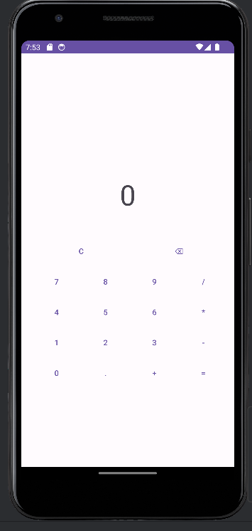
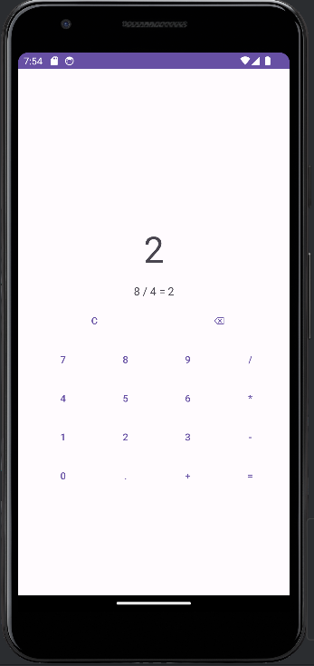

# Calculadora

## Descrição
Este projeto é uma calculadora simples desenvolvida no Android Studio com Java, que permite realizar operações matemáticas básicas como adição, subtração, multiplicação e divisão.

## Pré-requisitos
- Android Studio instalado na sua máquina.
- Conhecimento básico de desenvolvimento Android.

## Instalação
1. Abra o Android Studio.
2. Importe o projeto selecionando a opção "Import Project".
3. Aguarde o Android Studio sincronizar e baixar as dependências do projeto.

## Utilização
1. Abra o projeto no Android Studio.
2. Compile e execute o aplicativo em um emulador ou dispositivo Android conectado.
3. Use a calculadora para realizar operações matemáticas básicas.

## Funcionalidades
- Adição de números.
- Subtração de números.
- Multiplicação de números.
- Divisão de números.
- Botão de limpar para zerar o visor.
- Tratamento de erros básicos.

## Screenshots

---

Este README serve como um guia básico para entender e utilizar o projeto Calculadora desenvolvido no Android Studio. Sinta-se à vontade para personalizar conforme necessário.
